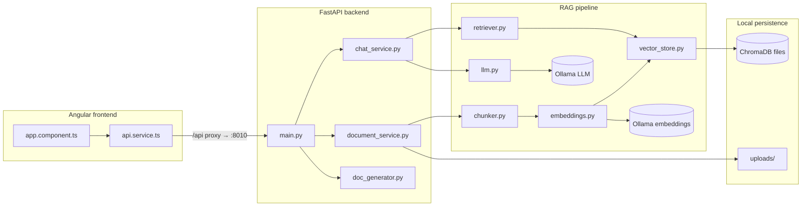

# Project map

This document describes how the RAG demo is structured, how data flows through the system, and where to change behavior.

For a concise agent-oriented orientation (read order, stack, gitignored paths), see [AGENTS.md](./AGENTS.md).

## Architecture overview



## Request flows

### Upload and index

1. Browser sends `POST /upload` with a file.
2. `DocumentService` extracts text, splits chunks (`rag/chunker.py`), embeds via Ollama (`rag/embeddings.py`), writes vectors to Chroma (`rag/vector_store.py`), and stores the original file under `backend/uploads/`.

### Chat (RAG)

1. Browser sends `POST /chat` with `{ "message": "..." }`.
2. `ChatService` embeds the question, retrieves similar chunks (`rag/retriever.py`), builds a prompt (`rag/prompts.py`), calls the LLM (`rag/llm.py`), returns answer plus source filenames.

### Optional: bulk indexing

- **`POST /index-knowledge-base`** — Indexes markdown files from the directory set in `KNOWLEDGE_BASE_DIR` (see `.env.example`).
- **`POST /scan-and-index`** — Scans `KNOWLEDGE_BASE_DIR` for supported files and indexes them (see API docs for parameters).
- **`POST /clear-index`** — Clears the vector index (destructive).
- Startup **`AUTO_GENERATE_DOCS`** — When enabled, generates markdown from an Angular tree (`TARGET_APP_SOURCE`) via `DocGeneratorService`, then indexes those files.

## Directory layout

```
rag-demo/
├── README.md                 # How to install and run
├── PROJECT_MAP.md            # This file
├── scripts/
│   └── generate-docs.py      # CLI to generate Angular markdown docs (optional)
├── backend/
│   ├── main.py               # FastAPI app, routes, CORS, lifespan hooks
│   ├── config.py             # Settings from environment / .env
│   ├── requirements.txt
│   ├── .env.example          # Template for configuration
│   ├── uploads/              # Uploaded originals (gitignored except .gitkeep)
│   ├── chroma_data/          # Chroma persistence (gitignored, created at runtime)
│   ├── rag/
│   │   ├── chunker.py        # Text splitting
│   │   ├── embeddings.py     # Ollama embedding client
│   │   ├── llm.py            # Ollama chat/completions
│   │   ├── prompts.py        # RAG prompt templates
│   │   ├── retriever.py      # Query → chunk retrieval
│   │   └── vector_store.py   # Chroma wrapper
│   └── services/
│       ├── document_service.py   # Upload pipeline orchestration
│       ├── chat_service.py       # Chat + RAG orchestration
│       └── doc_generator.py      # Angular source → markdown (used by API and scripts)
└── frontend/
    ├── angular.json
    ├── package.json
    ├── src/
    │   ├── main.ts
    │   ├── index.html
    │   ├── styles.scss
    │   └── app/
    │       ├── app.component.ts    # Standalone UI: upload, doc list, chat
    │       └── services/
    │           └── api.service.ts # Backend base URL and HTTP calls
    └── public/
```

## Backend API surface

| Method | Path | Role |
|--------|------|------|
| GET | `/health` | Basic API status and configured models |
| GET | `/model-status` | Whether Ollama reports LLM/embed models available |
| POST | `/upload` | Upload and index one file |
| GET | `/documents` | List indexed documents |
| DELETE | `/documents/{filename}` | Remove document from store |
| POST | `/chat` | RAG chat |
| POST | `/index-knowledge-base` | Index markdown from `KNOWLEDGE_BASE_DIR` |
| POST | `/scan-and-index` | Scan knowledge dir and index files |
| DELETE | `/clear-index` | Drop vector index |

Interactive schemas: `http://localhost:8010/docs` when the backend is running (default `API_PORT`; yours may differ).

## Frontend ↔ backend

The UI uses only a subset of the API (see `frontend/src/app/services/api.service.ts`):

- `GET /health`, `GET /model-status`
- `POST /upload`, `GET /documents`, `DELETE /documents/{filename}`
- `POST /chat`

In development, **`ApiService`** uses the same-origin prefix **`/api`**; **`frontend/proxy.conf.js`** forwards to the backend (default `http://127.0.0.1:8010`). Use env **`BACKEND_URL`** when starting `npm start`, or change the proxy target, if the API runs elsewhere.

## Configuration reference

All backend tuning goes through environment variables (see `backend/.env.example` and `backend/config.py`): Ollama URL and model names, Chroma directory, upload limits, optional `KNOWLEDGE_BASE_DIR`, optional Angular doc generation paths, `CORS_ORIGINS`, and `AUTO_GENERATE_DOCS`.
